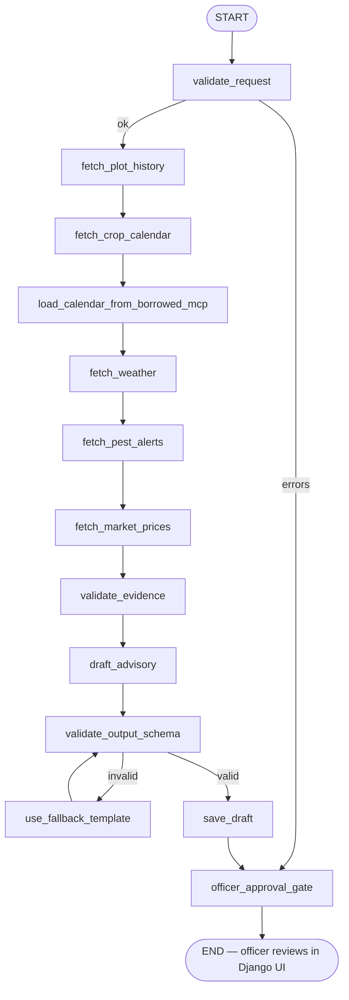

# ARCHITECTURE — Kachieng AI Agent (one page)

## Agent shape (LangGraph)



The graph is built in `apps/agents/graph.py` with `langgraph.graph.StateGraph`. State is the `AgentState` TypedDict (`apps/agents/state.py`). Each node is a plain function that returns a dict patch. Conditional edges route on errors (missing data, stale sources, model-output invalidity, model unavailable).

**`load_calendar_from_borrowed_mcp`** is the node that exercises the **borrowed** official filesystem MCP server. It reads `docs/calendars/sample_calendar.txt` (either directly for the dev default, or via `npx @modelcontextprotocol/server-filesystem` if `MAJISHAMBA_BORROWED_MCP_USE_NPX=1`) and logs the call to `AuditEvent(tool_name="borrowed_filesystem_mcp")`. This satisfies the "borrowed MCP server must be demonstrably used" requirement.

**Validation-retry behaviour.** If `validate_output_schema` finds errors, it routes to the `use_fallback_template` node — **not** back to `draft_advisory`. Re-calling a non-deterministic model on a structural validation failure is wasteful and unlikely to fix the issue. The fallback template produces guaranteed-valid JSON, which re-validates and proceeds to `save_draft`.

After `officer_approval_gate` the agent stops. Approval happens **outside** the graph, in the Django UI (`apps/approvals/views.py`). Only after the officer approves does the system call `apps.tasks.service.create_follow_up_task_after_approval`, which is the same function the MCP action tool wraps.

## Open-weights model

`draft_advisory` calls `ollama.Client(host=OLLAMA_HOST).generate(model="qwen2.5:7b-instruct", ...)` with a strict JSON-only prompt. Output is fenced-stripped, JSON-parsed, and validated against `AdvisoryDraft` (Pydantic). If Ollama is unreachable or `MAJISHAMBA_SKIP_OLLAMA=1` is set, the node goes straight to the template. If validation fails, the graph routes to `use_fallback_template` (no Ollama re-call). `Advisory.generation_mode` records `ollama_qwen` vs `fallback_template` so the demo and EVALS can show the difference.

**Timeouts.** Dev default: 10 seconds (fast failure → fallback). Production default: 60 seconds. Override with `MAJISHAMBA_OLLAMA_TIMEOUT=<seconds>`. Tests set `MAJISHAMBA_SKIP_OLLAMA=1` via `tests/conftest.py` so the suite runs in ~2 seconds without depending on Ollama.

## Custom MCP server: `majishamba-extension-mcp`

Built with the official **MCP Python SDK** (`mcp.server.fastmcp.FastMCP`). Eight tools, all defined in `apps/mcp_tools/tools.py` and registered in `TOOL_REGISTRY`. Two are **action tools** (`create_draft_advisory_record`, `create_follow_up_task_after_approval`); the latter is **approval-gated** — it delegates to `apps.tasks.service.create_follow_up_task_after_approval` which checks `OfficerApproval(decision=APPROVED)`.

The same `TOOL_REGISTRY` functions are called from three places, in this exact order of authority:
1. The LangGraph agent (`apps/agents/graph.py`) — in-process.
2. The Django UI / approval views (`apps/approvals/views.py`).
3. The standalone MCP server (`apps/mcp_tools/server.py`) over stdio via FastMCP — for any external MCP-aware client (Claude Desktop, a test harness, a partner agent).

**Single logging path.** Each tool logs itself to `AuditEvent` via `log_tool_call` in `apps/audit/service.py`. The graph nodes do **not** add a second log entry — they just thread state. This avoids duplicate audit rows. The `actor_id` (requesting officer's id) is propagated from the runner → state → every tool call, so every `AuditEvent` row is attributed to a named officer.

This means behaviour is identical whether a tool is called by the agent, by the UI, or by an external MCP client. There is one code path per tool.

Every tool call is logged by `apps/audit/service.log_tool_call` → an `AuditEvent` row with sanitised inputs, summarised outputs, timestamp, actor, and approval status. Prompt-injection patterns are stripped from text fields by `_sanitize_inputs`.

## Borrowed MCP server

> We use the official filesystem MCP server to load approved crop-calendar documents during development because it provides safe, tested file access without building a custom document loader.

It is restricted to `docs/calendars/` (set via `MAJISHAMBA_BORROWED_FILESYSTEM_MCP_ROOT`). It is **not** exposed in production. The agent does not depend on it for the demo — the demo loads calendars from the database via `get_crop_calendar`. It exists to satisfy the "borrowed MCP server" requirement and to demonstrate MCP craft alongside the custom server.

## Data flow

```text
Extension Officer (browser) ──HTMX──▶ Django view (apps/advisories/views.py)
                                          │
                                          ▼
                          apps/agents/runner.run_advisory_pipeline
                                          │
                                          ▼
                          LangGraph (apps/agents/graph.py)
                                          │
              ┌───────────────────────────┼─────────────────────────────┐
              ▼                           ▼                              ▼
   apps/mcp_tools/tools.*         Ollama qwen2.5:7b-instruct     Pydantic validation
   (custom MCP, in-process)        (or fallback template)        (AdvisoryDraft schema)
              │                           │                              │
              └───────────┬───────────────┴──────────────────────────────┘
                          ▼
                  apps/audit/service.log_tool_call   (every call)
                          ▼
                  Advisory(DRAFT)  →  Django UI  →  OfficerApproval(APPROVED)
                          ▼
                  apps/tasks.service.create_follow_up_task_after_approval  (gate)
                          ▼
                  FollowUpTask  (status=ASSIGNED)
```

## Approval gate design

The gate is **non-negotiable**:

- `create_draft_advisory_record` is an action tool, but it only persists a DRAFT. No external message is sent.
- `create_follow_up_task_after_approval` is an action tool that **must** find a valid `OfficerApproval(decision=APPROVED)` for the (advisory_id, officer_id) pair before creating a `FollowUpTask`. If the gate fails, the tool returns an error dict and **no task is created**.
- The Django view `apps/approvals/views.ApprovalGateView` is the only path that creates `OfficerApproval` rows. It requires `user.can_approve()` (extension officer or supervisor role).

## Why LangGraph (not custom)

LangGraph gives us named nodes + typed state + conditional edges + the ability to stop at a human gate. A custom state machine would have re-implemented the same primitives. LangGraph is open-source, audit-friendly, and easy to read in `apps/agents/graph.py`.

## Why an MCP server (not just functions)

The custom MCP server is the contract surface. Tools can be invoked by the agent (in-process), by the Django UI (in-process), and by external MCP clients (stdio) with **identical behaviour**. This is the point of MCP — a single, observable tool interface that any client can call.

## Why a borrowed filesystem MCP server

Because approved crop-calendar PDFs already exist as files; building a custom document loader would be reinventing a tested, maintained tool. The official filesystem MCP server is restricted to `docs/calendars/` so it cannot leak arbitrary files.

## Why Qwen2.5-7B-Instruct via Ollama

It is an open-weights model that runs locally on a single workstation, which matters for an institution that does not want to send household/plot data to a hosted API. The 7B-Instruct variant follows structured prompts (JSON-only, schema-strict) well enough to validate. The deterministic fallback covers outages.

## Security / governance defaults

- Django authentication, role-based (extension officer / supervisor / viewer), `require_officer` / `require_approver` server-side guards on every mutating view.
- CSRF on all POSTs; HTTPS enforced in `production.py`; HSTS, HttpOnly sessions, SameSite=Lax.
- Pydantic validation on every MCP tool input (see `apps/agents/schemas.py`) and on the model's JSON output (`AdvisoryDraft`).
- Structured JSON logging without secrets; `_sanitize_inputs` strips prompt-injection phrases.
- Audit log (`AuditEvent`) for every tool call, every HTTP mutation, every agent run start/end, every approval.
